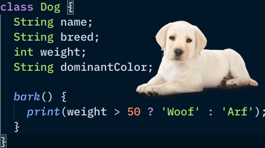
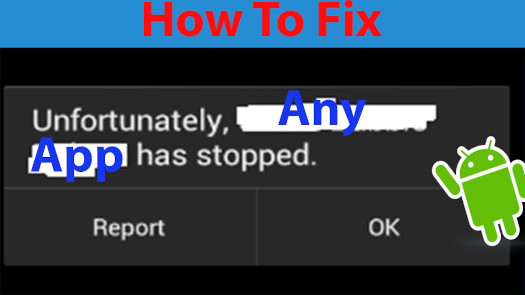
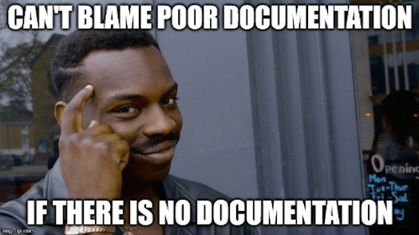
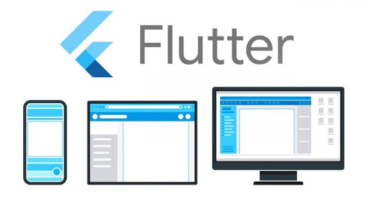

### What is it?

* This course focuses on object-oriented programming (OOP).

### What is it?

* Solve a problem by modelling real-world objects in your code.
* Mainstream programming style (formally called a **paradigm**)
* 8 of the 10 programming languages in the TIOBE Index Top 10 are primarily OOP
  - as of July 2020
  - TIOBE rankings change from time to time

### What language?

* Java is used in most traditional OOP courses
* CPU SE is **not** traditional, so let's use a hipster language from Google

---

### What we'll learn? (1/7)

Represent/mimic/**model** a single, real-world object inside our code.

### What you'll learn? (2/7)

OOP is easy-to-learn, but difficult-to-master. It's easy to go astray.  We'll learn _principles_ and 
_best practices_ along the way

### What you'll learn? (3/7)

Some of these objects are similar (all these animals breathe), but they do have slight differences.
We can model them in our OOP code too.

### What you'll learn? (4/7)

Build big objects that are **compose**d of smaller objects.  A
petshop is made up of pets, the veterinarian, shelves, customers, pet food, etc.

### What you'll learn? (5/7)

Things that can go wrong in our apps are also objects 😮, they're heavy, they get **throw**n around, 
and will crash our apps if we don't **catch** 'em.

### What you'll learn? (6/7)

When our app has now 1337 different kinds of objects, our brains will melt.  We'll learn some
notations to give us bird's eye views of how these objects interact.

### What you'll learn? (7/7)

CLI apps get boring after a while, but your next Uber for Sardines startup idea
needs a GUI right?  You'll build a mobile app or game for your final project.

### Pre-requisites

* SE 1121 - Software Development I

* Pre-requisite knowledge:
  - variables
  - conditionals
  - loops
  - arrays / lists
  - functions

### Which courses need SE 1223 as a prereq?

* SE 1222 - Data Structures (co-requisite)
* passers of this course can take SE 2224 (Software Engieering Tools and Practices)
* other sophomore courses require SE 1222 (Data Structures) as well