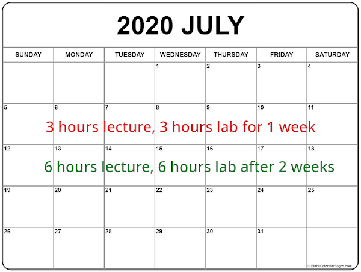

### Summer Classes are fast-paced

* July isn't really summer in the Philippines
  - UP calls it midyear classes
  - let's call it midyear classes for correctness
* SE 1223 is a 3-unit lecture, 3 unit lab course
  - a semester has 18 weeks, so we need 54 hours of lec + 54 hours of lab
  - to get 54 hours of both in summer, we need 2 hours each day for 27 days!

#### Semestral Classes are chill-paced

#### ~~Summer~~ Midyear Classes are fast-paced

### If you think you have time for
  

Think again...😁
